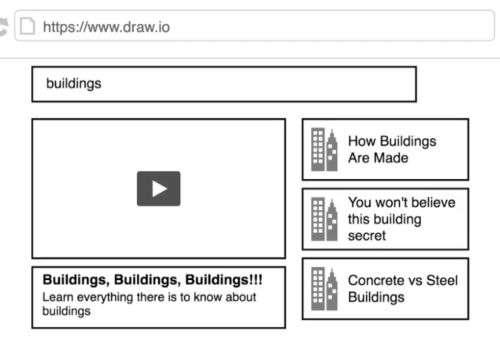

# ClipTube

Os presento esta sencilla "réplica" de la web de Youtube.  
Esta réplica ha sido creada con fines meramente didácticos. 
Para practicar y profundizar en la creación de páginas web mediante React.  

Conceptos nuevos que estoy practicando: 

1. Hacer fetch a una API con la librería Axios, en lugar del método Fetch. 
2. He aprendido sobre el uso de useRef. 
3. He practicado convirtiendo componente sde clase en componentes funcinales. 
4. Este proyecto lo he estilado usando CSS semántico de las siguientes páginas:  https://semantic-ui.com/ y https://cdnjs.com/libraries/semantic-ui

Es posible que este proyecto, resulte útil a padres que ponen YouTube a sus hijos pero temen que se metan dónde no deben. Con esta web tan simple, sólo podrás buscar vídeos y reproducirlos, nada de suscribirse a ningún canal, poner comentarios... o cualquier imprevisto que pueda surgir de la navegación de los más pequeños de la casa.

## Diagramas/Esquema de la ClipTube

## Objetivo
El funcionamiento es sencillo, se hace una petición a la API de Youtube, concretamente a su información pública cuando se busca algún texto en el input que hay en la página.  
La web muestra un listado de videos que coinciden con el término buscado y en última instancia, implementaré una descripción del vídeo y la ventana de reporudcción del mismo.  
No está implementado el sistema de autorización y atenticación de usuarios.

## Visualización
Puedes visualizar el proyecto a través de este enlace: https://storrecu.github.io/ClipTube

Si quieres trastear el proyecto, te recomiento hacer un fork del mismo: 
- Ves a al esquina superior derecha y pulsa en "Fork".
- Selecciona el usuario de GitHub dónde quieres hacer el fork. 
- Clona el proyecto forkeado en tu ordenador de forma local.
- Una vez tengas el proyecto en local, ábrelo con tu editor de código y ejecuta en la terminal: npm start.

Así, podrás ver hasta que punto está desarrollado el proyecto. 
No te pido que hagas un git clone, porque si realizas algún cambio en el repositorio, puedes trastocar lo que estoy desarrollando ahora mismo, así que te agradezco mucho si haces un frok en su lugar. 

## Sugerencias
Si has hecho el proceso de crearte un fork del repositorio, lo has visualizado localmente y crees que hay algo que podría mejorar o hay cosas que no entiendes, no dudes en escribirme. 
Aquí tienes todas las vías para contactar conmigo: 
  
